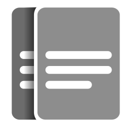

# New Tab Group Notes

This is a chrome-extension that replaces your new tab with a tab-group organizer!
You can quickly navigate to those tabs, and leave notes for yourself about the tabs on this page!

### Local Installation

1. [Download `new-tab-group-notes.zip` from the releases tab](https://github.com/JRJurman/new-tab-group-notes/releases) of the project onto your local machine. Extract the folder onto your local machine.

2. Open the extensions management page for your browser, most likely [chrome://extensions/](chrome://extensions/).

3. Select `Load unpacked`, and select the `new-tab-group-notes-extension` folder. It should now appear in your extensions with the appropriate icon and description. You may have to temporarily enable `Developer Mode` to do this.

## Development instructions

1. In the root directory, run `npm ci` to install all the project dependencies
2. Run `npm start` to start the dev server
3. Load the dist folder as an unpacked extension in chrome browser
4. Open a new tab

## Development commands

Below are a list of commands used for development. The logic for all the commands is in the local `package.json`

- `npm start` - builds the project into the dist folder and starts a watch loop for changes
- `npm run build` - builds a final distributable using [Parcel](https://parceljs.org/)
- `npm test` - runs tests in [Jest](https://jestjs.io/) watch loop

## Resources

- Logo created by Jesse Jurman for this Project
- Written in [Tram-One](https://tram-one.io/)
- Styles from [Open Props](https://open-props.style/)
- Other icons from [Feather](https://feathericons.com/)
